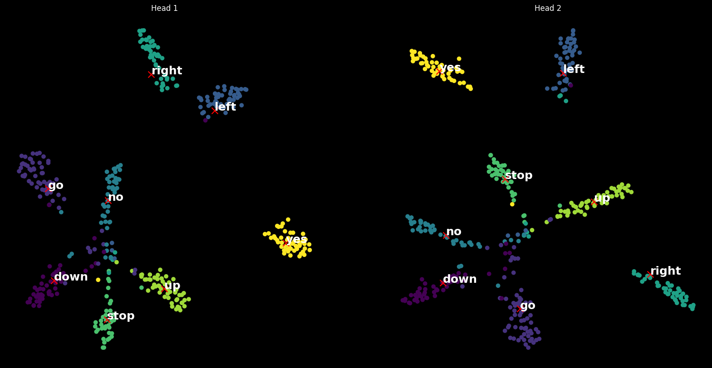
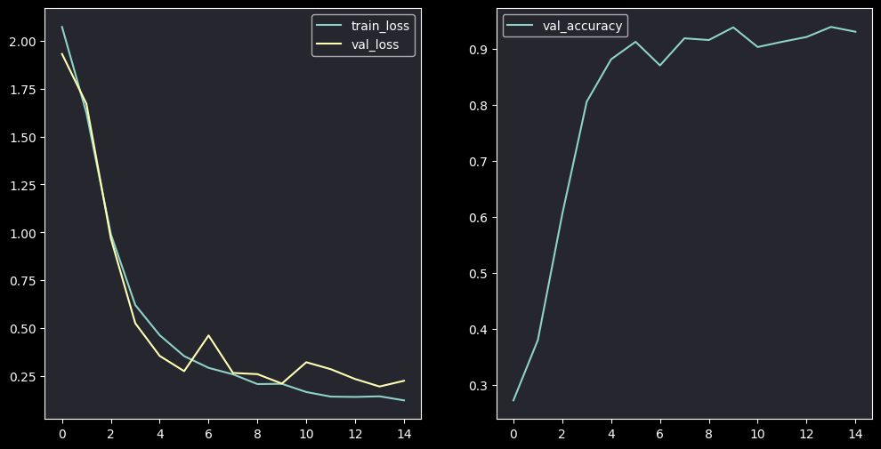
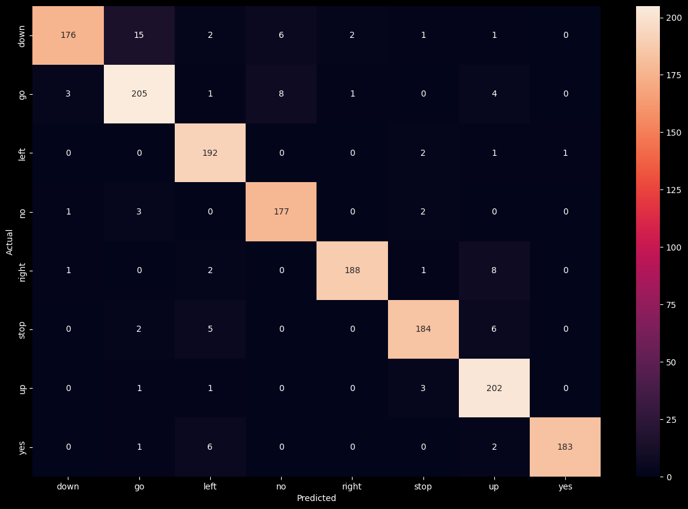

# Audio Classification using ResNet CNN on Mini Speech Commands

This project focuses on classifying audio commands from the [Mini Speech Commands Dataset](https://www.tensorflow.org/datasets/catalog/speech_commands) using a custom ResNet CNN architecture. The audio signals are pre-processed using Short-Time Fourier Transform (STFT) to generate spectrograms, which are then used as input to the classifier. Also we visualize the embeddings generated by the model using t-SNE for dimensionality reduction, providing insights into the learned features, see the t-SNE plot below.




## Table of Contents

- [Overview](#overview)
- [Dataset](#dataset)
- [Preprocessing](#preprocessing)
- [Model Architecture](#model-architecture)
- [Embeddings Visualization](#embeddings-visualization)
- [How to Run](#how-to-run)
- [Results](#results)
- [Future Work](#future-work)
- [Acknowledgements](#acknowledgements)

## Overview

The goal of this project is to build a ResNet-based Convolutional Neural Network (CNN) to classify simple spoken commands, such as "go," "stop," "yes," and "no." The classifier produces two separate embedding vectors of shape `[batch_size, 64]` from different heads, which are then visualized using t-SNE for dimensionality reduction. The attached figure shows the t-SNE plots of the embeddings from both heads.

## Dataset

We are using the Mini Speech Commands dataset, which is a smaller version of the [Speech Commands dataset](https://www.tensorflow.org/datasets/catalog/speech_commands). It consists of short audio clips of spoken commands, including:

- "yes"
- "no"
- "up"
- "down"
- "left"
- "right"
- "go"
- "stop"

### Data Preprocessing

1. **STFT (Short-Time Fourier Transform):**  
   The audio clips are converted into spectrograms using the STFT, which transforms the audio signal from the time domain to the frequency domain.
   
2. **Spectrogram Generation:**  
   Spectrograms serve as input for the ResNet CNN model.

## Model Architecture

The model is based on a custom ResNet architecture designed for audio classification tasks. It consists of the following components:

1. **Residual Blocks:**  
   The core building blocks of the model are residual blocks, which help in learning complex features from the spectrograms. You can see the detailed architecture in the code and below:
   
   ```python
    class ResidualBlock(nn.Module):
        def __init__(self,
                        in_channels,
                        out_channels,
                        kernel_size=3,
                        downsample=False):
            super(ResidualBlock, self).__init__()
            stride = 2 if downsample else 1
            self.conv1 = nn.Conv2d(in_channels,
                                    out_channels,
                                    kernel_size,
                                    stride,                           
                                    padding=kernel_size//2, bias=False)
            self.bn1 = nn.BatchNorm2d(out_channels)
            self.relu = nn.ReLU()
            self.conv2 = nn.Conv2d(out_channels, out_channels, kernel_size, 1,
                                    padding=kernel_size//2, bias=False)
            self.bn2 = nn.BatchNorm2d(out_channels)
            self.downsample = nn.Sequential()
            if downsample or in_channels != out_channels:
                self.downsample = nn.Sequential(
                    nn.Conv2d(in_channels, 
                                out_channels, 1, 
                                stride, 
                                bias=False),
                    nn.BatchNorm2d(out_channels)
                )
            
        def forward(self, x):
            res = self.downsample(x)
            x = self.conv1(x)
            x = self.bn1(x)
            x = self.relu(x)
            
            x = self.conv2(x)
            x = self.bn2(x)
            x = x + res
            x = self.relu(x)
            return x
    ```

2. **ResnetCNN**
    Using the ResidualBlock class, we can define the ResnetCNN class as follows:

    ```python
    class ResnetCNN(BaseModel):
    def __init__(self,
                 in_channels=1,
                 num_filters=16,
                 num_filters_list=[],
                 output_dim=1,
                 kernel_size=3,
                 kernel_sizes=[],
                 num_conv_layers=3,
                 dropout=0.5):
        super(ResnetCNN, self).__init__()
        if not num_filters_list:
            num_filters_list = [num_filters] * num_conv_layers
            
        if not kernel_sizes:
            kernel_sizes = [kernel_size] * num_conv_layers

        if len(num_filters_list) != num_conv_layers:
            num_conv_layers = len(num_filters_list)
        layers = []
        for idx in range(num_conv_layers):
            conv_layer = ResidualBlock(in_channels=in_channels,
                                out_channels=num_filters_list[idx],
                                kernel_size=kernel_sizes[idx])
            layers.append(conv_layer)
            layers.append(nn.BatchNorm2d(num_filters_list[idx]))
            layers.append(nn.ReLU())
            layers.append(nn.MaxPool2d(kernel_size=2, stride=2))
            in_channels = num_filters_list[idx]
        
        self.conv_layers = nn.Sequential(*layers)
        self.pool = nn.AdaptiveMaxPool2d(output_size=1)
        self.dropout = nn.Dropout(dropout)
        self.fc1 = nn.Linear(num_filters_list[-1], num_filters_list[-1]) 
        self.relu = nn.ReLU()
        self.fc2 = nn.Linear(num_filters_list[-1], output_dim)
        
    
    def forward(self, x):
        x = self.conv_layers(x)
        x = self.pool(x)
        x = x.squeeze(-1)
        x = x.squeeze(-1)
        x = self.dropout(x)
        x = self.fc1(x)
        x = self.relu(x)
        x = self.fc2(x)
        return x
    ```


## Embeddings Visualization

After training, the embeddings generated by the two heads are projected to 2D using t-SNE (t-distributed Stochastic Neighbor Embedding) for visualization purposes. The attached image illustrates the embeddings from both heads. The clustering of commands like "left," "right," "yes," and "no" demonstrates the model's ability to learn distinct features for each command.


### VisModel 

To represent Head1 and Head2 embeddings, we can define the VisModel class as follows:

```python
    class VisModel(BaseModel):
        def __init__(self, custom_classifier):
            super(VisModel, self).__init__()
            
            self.custom_classifier = custom_classifier
            self.custom_classifier.to('cpu')
            self.to('cpu')
            
            # freeze the custom classifier
            for param in self.custom_classifier.parameters():
                param.requires_grad = False
            
            self.conv_layers = custom_classifier.conv_layers
            self.pool = custom_classifier.pool
            self.dropout = custom_classifier.dropout
            self.fc1 = custom_classifier.fc1
        
        def forward(self, x):
            x = self.conv_layers(x)
            x = self.pool(x)
            x = x.squeeze(-1)
            x = x.squeeze(-1)
            head1 = x
            head2 = self.fc1(head1)
            return head1, head2
```

## How to Run

1. Clone the repository:
   ```bash
   git clone https://github.com/xValentim/mini-audio-classifier
   cd mini-audio-classifier
   ```

2. Install dependencies:
   ```bash
   conda env create -f environment.yml
   conda activate env_name
   ```

3. Download and preprocess the Mini Speech Commands dataset (you just need run the notebook in ``notebook/load_and_vis_data.ipynb``):

4. Train the model:
   ```python
    in_channels = 1 # Default
    num_filters_list = [16, 32, 64, 64, 64] # Your configs
    kernel_sizes = [3, 3, 3, 3, 3]
    output_dim = 8
    model = ResnetCNN(in_channels=in_channels,
                    num_filters_list=num_filters_list,
                    kernel_sizes=kernel_sizes,
                    output_dim=output_dim) 

    model.compile(optimizer=torch.optim.Adam(model.parameters(), lr=4e-3),
                    loss_fn=nn.CrossEntropyLoss(),
                    device='cuda', # Or 'cpu'
                    metrics=["accuracy"])

    history = model.fit(train_dataset, 
                        n_epochs=15, 
                        validation_split=0.2)

   ```
5. Visualize embeddings: Run notebook in ``notebook/custom_classifier.ipynb``

## Results

The model achieves good performance in classifying the audio commands. Below are some key results:




The t-SNE visualization shows well-separated clusters for each command, indicating that the model learns distinctive features across different spoken commands. Also, the confusion matrix demonstrates the model's ability to classify the commands with high accuracy.

## Future Work

- **Experiment with other architectures:** Test different CNN architectures or Transformer models for improved performance.
- **Audio Generation:** Explore audio generation using generative models like VAEs and GANs with WaveNet or similar architectures.

## Acknowledgements

- **Dataset:** [Mini Speech Commands Dataset](https://www.tensorflow.org/datasets/catalog/speech_commands)